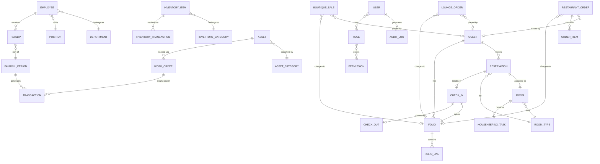

# AEHOP Domain Model
**Acemco Express Hotel Operations Platform**
Version 1.0 — July 2026

---

> [!IMPORTANT]
> This document is a foundational governance artifact. It defines every business domain in the system, the entities and rules within them, and how domains interact. All database schemas, API contracts, and business logic must derive from this model.

---

## Table of Contents

1. [Domain Glossary](#1-domain-glossary)
2. [Domain Map](#2-domain-map)
3. [Core Domains](#3-core-domains)
4. [Service Domains](#4-service-domains)
5. [Operations Domains](#5-operations-domains)
6. [People Domains](#6-people-domains)
7. [Financial Domain](#7-financial-domain)
8. [Platform Domains](#8-platform-domains)
9. [Cross-Domain Relationship Overview](#9-cross-domain-relationship-overview)
10. [Domain Interaction Matrix](#10-domain-interaction-matrix)
11. [Business Invariants](#11-business-invariants)

---

## 1. Domain Glossary

Canonical terminology. All code, documentation, and UI copy must use these terms.

| Term | Definition | Never Use |
|---|---|---|
| **Guest** | A person who has or is making a reservation, or is currently staying | Customer (in hotel ops) |
| **Employee** | A person employed by Acemco Express Holiday Inn | Staff (in HR records) |
| **Reservation** | A confirmed booking of a room by a guest | Booking (internally) |
| **Room** | A rentable accommodation unit | Bedroom, Unit |
| **Room Type** | A classification of rooms by size, tier, and features | Room Category |
| **Asset** | Any maintainable physical item tracked by the Maintenance domain | Equipment |
| **Restaurant** | The hotel's food service establishment | Kitchen (customer-facing) |
| **Lounge** | The hotel's beverage and cocktail service establishment | Bar |
| **Boutique** | The hotel's retail sales establishment | Shop, Store |
| **POS** | Point of Sale system covering Restaurant, Lounge, and Boutique | Cashier system |
| **Work Order** | A maintenance task assigned to an asset | Ticket, Job card |
| **Folio** | A running record of all charges associated with a guest's stay | Bill, Invoice (during stay) |
| **Check-In** | The process of admitting a guest to their assigned room | Arrival |
| **Check-Out** | The process of releasing a guest from their room and settling charges | Departure |
| **Walk-In** | A guest who requests a room without a prior reservation | |
| **Availability** | The count of rooms of a given type free for a given date range | |
| **Payroll Period** | A defined calendar span for which payroll is calculated | |
| **Payslip** | Per-employee record of earnings and deductions for one payroll period | |

---

## 2. Domain Map

```
┌──────────────────────────────────────────────────────────────────┐
│                    PLATFORM DOMAINS                               │
│         Auth & Identity · CMS · Reports · Notifications           │
│                         Audit Log                                 │
└───────────────────────┬──────────────────────────────────────────┘
                        │ shared by all domains
┌───────────────────────▼──────────────────────────────────────────┐
│                     CORE DOMAINS                                  │
│          Rooms · Guests · Reservations · Reception                │
└──────────┬────────────────────────────┬───────────────────────────┘
           │                            │
┌──────────▼──────────┐   ┌─────────────▼───────────────────────────┐
│   SERVICE DOMAINS   │   │         OPERATIONS DOMAINS               │
│  Restaurant · Lounge│   │  Inventory · Housekeeping · Maintenance  │
│  Boutique           │   └─────────────────────────────────────────┘
└─────────────────────┘                 │
                        ┌───────────────▼────────────────┐
                        │        PEOPLE DOMAINS           │
                        │          HR · Payroll           │
                        └───────────────┬────────────────┘
                                        │
                        ┌───────────────▼────────────────┐
                        │       FINANCIAL DOMAIN          │
                        │            Finance              │
                        └────────────────────────────────┘
```

---

## 3. Core Domains

### 3.1 Auth & Identity Domain

**Responsibility**: Manages who can access the system and what they can do.

#### Entities & Aggregates

**User** (Aggregate Root)
| Field | Type | Notes |
|---|---|---|
| id | UUID | Primary key |
| email | string | Unique, lowercase |
| passwordHash | string | bcrypt |
| isActive | boolean | Soft-disable |
| employeeId | UUID? | FK → Employee (nullable) |
| lastLoginAt | datetime? | |
| createdAt / updatedAt | datetime | |

**Role** (Entity)
| Field | Type | Notes |
|---|---|---|
| id | UUID | |
| name | string | Unique e.g. `HOTEL_MANAGER` |
| description | string | |
| isSystem | boolean | System roles cannot be deleted |

**Permission** (Entity)
| Field | Type | Notes |
|---|---|---|
| id | UUID | |
| module | string | e.g. `reservations` |
| action | enum | `VIEW` `CREATE` `UPDATE` `DELETE` `APPROVE` `EXPORT` `PRINT` |
| description | string | |

**RefreshToken** (Entity)
| Field | Type | Notes |
|---|---|---|
| id | UUID | |
| userId | UUID | FK → User |
| token | string | Hashed |
| expiresAt | datetime | |
| revokedAt | datetime? | |

#### System Roles (Seed Data)

| Role | Description |
|---|---|
| SUPER_ADMIN | Unrestricted access to all modules |
| HOTEL_MANAGER | Full operational access, no system settings |
| RECEPTION | Reservations, check-in/out, guest management |
| HR | Employee records, attendance, leave, payroll view |
| FINANCE | Financial records, reports, payroll approval |
| RESTAURANT_MANAGER | Restaurant POS, menu, inventory (restaurant) |
| LOUNGE_MANAGER | Lounge POS, menu, inventory (lounge) |
| BOUTIQUE_MANAGER | Boutique POS, inventory (boutique) |
| MAINTENANCE | Asset management, work orders |
| HOUSEKEEPING | Housekeeping tasks |
| INVENTORY_OFFICER | All inventory management |

#### Domain Rules
- A user must have at least one role.
- Permissions override roles — a directly-granted permission takes precedence.
- Inactive users cannot authenticate.
- Access tokens expire after **15 minutes**; refresh tokens after **7 days**.
- All authentication events are written to the Audit Log.

---

### 3.2 Rooms Domain

**Responsibility**: Defines and manages the physical room inventory.

#### Entities & Aggregates

**RoomType** (Aggregate Root)
| Field | Type | Notes |
|---|---|---|
| id | UUID | |
| name | string | e.g. "Deluxe Suite" |
| description | text | |
| maxOccupancy | int | |
| bedConfiguration | string | e.g. "1 King Bed" |
| basePrice | decimal | Default nightly rate |
| features | string[] | e.g. ["WiFi", "Pool View"] |
| images | string[] | S3 keys |
| isActive | boolean | |
| sortOrder | int | |

**Room** (Aggregate Root)
| Field | Type | Notes |
|---|---|---|
| id | UUID | |
| roomNumber | string | Unique e.g. "101" |
| floor | int | |
| roomTypeId | UUID | FK → RoomType |
| status | RoomStatus | |
| isActive | boolean | |
| notes | text? | Internal |

**RoomStatus** (Value Object — Enum)
| Value | Description |
|---|---|
| `AVAILABLE` | Ready for check-in |
| `OCCUPIED` | Guest currently checked in |
| `RESERVED` | Confirmed reservation, not yet checked in |
| `CLEANING` | Under housekeeping |
| `INSPECTION` | Awaiting inspection after cleaning |
| `MAINTENANCE` | Under a maintenance work order |
| `OUT_OF_ORDER` | Temporarily unavailable |
| `BLOCKED` | Administratively blocked |

**RoomPricing** (Entity)
| Field | Type | Notes |
|---|---|---|
| id | UUID | |
| roomTypeId | UUID | FK → RoomType |
| label | string | e.g. "Weekend Rate" |
| pricePerNight | decimal | |
| validFrom / validTo | date | |
| isDefault | boolean | |

#### Domain Rules
- A room cannot transition directly from `OCCUPIED` to `AVAILABLE`.
- Rooms with status `MAINTENANCE` or `OUT_OF_ORDER` cannot be reserved.
- A room can only be in one status at a time.
- Deleting a RoomType is not permitted if active rooms reference it — soft-archive instead.

---

### 3.3 Guests Domain

**Responsibility**: Maintains the central record of all guests.

#### Entities & Aggregates

**Guest** (Aggregate Root)
| Field | Type | Notes |
|---|---|---|
| id | UUID | |
| title | enum | `MR` `MRS` `MS` `DR` `PROF` `OTHER` |
| firstName / lastName | string | |
| email | string? | Optional |
| phone | string | Required |
| nationality | string? | ISO country code |
| dateOfBirth | date? | |
| address | Address (VO) | |
| idType | enum | `PASSPORT` `NATIONAL_ID` `DRIVER_LICENSE` |
| idNumber | string | |
| idExpiryDate | date? | |
| notes | text? | Internal |
| isVip | boolean | |
| isBlacklisted | boolean | |

**Address** (Value Object)
| Field | Type |
|---|---|
| street | string? |
| city | string? |
| state | string? |
| country | string |
| postalCode | string? |

**GuestDocument** (Entity)
| Field | Type | Notes |
|---|---|---|
| id | UUID | |
| guestId | UUID | FK → Guest |
| documentType | string | e.g. "Passport Copy" |
| fileKey | string | S3 key |
| uploadedAt | datetime | |

#### Domain Rules
- Guest records are never hard-deleted — only archived.
- A blacklisted guest cannot complete a new reservation.
- Phone is required; email is optional.
- Guests with `isVip = true` trigger an alert at reception during check-in.

---

### 3.4 Reservations Domain

**Responsibility**: Manages the full lifecycle of room reservations.

#### Entities & Aggregates

**Reservation** (Aggregate Root)
| Field | Type | Notes |
|---|---|---|
| id | UUID | |
| reservationNumber | string | e.g. `RES-2026-00042` |
| guestId | UUID | FK → Guest |
| roomId | UUID? | Assigned room (may be null until check-in) |
| roomTypeId | UUID | FK → RoomType |
| checkInDate / checkOutDate | date | |
| adults / children | int | |
| status | ReservationStatus | |
| source | enum | `WEBSITE` `WALK_IN` `PHONE` `OTA` `INTERNAL` |
| specialRequests | text? | |
| totalAmount | decimal | Calculated at booking |
| depositAmount | decimal | |
| depositPaid | boolean | |
| confirmedAt / cancelledAt | datetime? | |
| cancellationReason | text? | |
| createdByUserId | UUID? | Null if self-service |

**ReservationStatus** (Value Object — Enum)
| Value | Description |
|---|---|
| `PENDING` | Created, awaiting confirmation |
| `CONFIRMED` | Confirmed by hotel |
| `CHECKED_IN` | Guest has checked in |
| `CHECKED_OUT` | Guest has checked out |
| `CANCELLED` | Cancelled by guest or hotel |
| `NO_SHOW` | Guest did not arrive |

#### Domain Rules
- `checkOutDate` must be strictly after `checkInDate`.
- A confirmed reservation blocks room availability for its duration.
- Cancellation of a `CHECKED_IN` reservation is not permitted; checkout must be processed.
- `totalAmount` is recalculated if dates change; difference is recorded as an adjustment.
- ReservationNumber is unique and generated sequentially with prefix.

---

### 3.5 Reception Domain

**Responsibility**: Front-desk operations — walk-ins, check-in, check-out, room assignment, guest folios.

#### Entities & Aggregates

**CheckIn** (Aggregate Root)
| Field | Type | Notes |
|---|---|---|
| id | UUID | |
| reservationId | UUID? | FK → Reservation (null for walk-ins) |
| guestId | UUID | FK → Guest |
| roomId | UUID | FK → Room |
| checkedInAt | datetime | |
| checkedInByUserId | UUID | FK → User |
| keyIssued | boolean | |

**CheckOut** (Aggregate Root)
| Field | Type | Notes |
|---|---|---|
| id | UUID | |
| checkInId | UUID | FK → CheckIn |
| guestId | UUID | FK → Guest |
| roomId | UUID | FK → Room |
| checkedOutAt | datetime | |
| checkedOutByUserId | UUID | FK → User |
| folioId | UUID | FK → Folio |
| totalCharged | decimal | |
| paymentMethod | enum | `CASH` `CARD` `TRANSFER` `CREDIT` |

**WalkIn** (Entity)
| Field | Type | Notes |
|---|---|---|
| id | UUID | |
| guestId | UUID | FK → Guest |
| roomTypeId | UUID | FK → RoomType |
| roomId | UUID? | Assigned room |
| handledByUserId | UUID | FK → User |
| status | enum | `PENDING` `CONFIRMED` `DECLINED` |

**Folio** (Aggregate Root)
| Field | Type | Notes |
|---|---|---|
| id | UUID | |
| guestId | UUID | FK → Guest |
| checkInId | UUID | FK → CheckIn |
| status | enum | `OPEN` `SETTLED` `DISPUTED` |
| openedAt | datetime | |
| settledAt | datetime? | |

**FolioLine** (Entity)
| Field | Type | Notes |
|---|---|---|
| id | UUID | |
| folioId | UUID | FK → Folio |
| description | string | |
| amount | decimal | |
| type | enum | `ROOM_CHARGE` `RESTAURANT` `LOUNGE` `BOUTIQUE` `DAMAGE` `SERVICE` `DISCOUNT` `TAX` |
| referenceId | UUID? | FK to source transaction |
| postedAt | datetime | |

#### Domain Rules
- Room must be `AVAILABLE` or `RESERVED` before check-in.
- Check-in sets room status to `OCCUPIED`.
- Check-out sets room status to `CLEANING`.
- Only one active CheckIn can exist per room at a time.
- A folio in `DISPUTED` status cannot be settled.

---

## 4. Service Domains

### 4.1 Restaurant Domain

**Shared Pattern**: Restaurant, Lounge, and Boutique all use a shared `MenuItem` and `MenuCategory` structure differentiated by a `storefront` enum field. Orders are similarly structured.

**MenuCategory** (Shared Entity)
| Field | Type | Notes |
|---|---|---|
| id | UUID | |
| storefront | enum | `RESTAURANT` `LOUNGE` `BOUTIQUE` |
| name | string | e.g. "Starters" |
| imageKey | string? | S3 key |
| sortOrder | int | |
| isActive | boolean | |

**MenuItem** (Shared Aggregate Root)
| Field | Type | Notes |
|---|---|---|
| id | UUID | |
| categoryId | UUID | FK → MenuCategory |
| storefront | enum | |
| name | string | |
| description | text? | |
| price | decimal | |
| imageKey | string? | S3 key |
| isAvailable | boolean | |
| isSeasonal | boolean | |
| isHidden | boolean | Hidden from website, visible to staff |
| tags | string[] | e.g. ["Vegetarian", "Spicy"] |
| preparationTime | int? | Minutes |
| sortOrder | int | |

**RestaurantOrder / LoungeOrder / BoutiqueSale** (Aggregate Roots — same structure per storefront)
| Field | Type | Notes |
|---|---|---|
| id | UUID | |
| orderNumber | string | e.g. `REST-2026-00219` |
| storefront | enum | |
| source | enum | `INTERNAL_POS` `WEBSITE` `ROOM_SERVICE` |
| guestId | UUID? | FK → Guest (optional) |
| roomNumber | string? | For room service / website orders |
| tableNumber | string? | Restaurant dine-in |
| customerName | string? | Non-guest website orders |
| customerPhone | string? | |
| deliveryLocation | string? | |
| specialInstructions | text? | |
| status | OrderStatus | |
| totalAmount | decimal | |
| handledByUserId | UUID? | FK → User |

**OrderItem** (Entity)
| Field | Type | Notes |
|---|---|---|
| id | UUID | |
| orderId | UUID | FK → Order |
| menuItemId | UUID | FK → MenuItem |
| quantity | int | |
| unitPrice | decimal | Price captured at order time — immutable |
| notes | string? | Per-item instruction |
| subtotal | decimal | Computed |

**OrderStatus** (Value Object — Enum)
`PENDING` → `CONFIRMED` → `PREPARING` → `READY` → `DELIVERED` → `COMPLETED` / `CANCELLED`

**Table** (Entity — Restaurant only)
| Field | Type | Notes |
|---|---|---|
| id | UUID | |
| tableNumber | string | e.g. "T01" |
| capacity | int | |
| status | enum | `AVAILABLE` `OCCUPIED` `RESERVED` |

#### Domain Rules
- A MenuItem with `isAvailable = false` cannot be added to any new order.
- A MenuItem with `isHidden = true` is excluded from public website menus.
- `unitPrice` on OrderItem is immutable after the item is added to an order.
- Website orders (source = `WEBSITE`) are saved before the WhatsApp message is generated.
- Completed orders post revenue to Finance and optionally to a guest's Folio.

---

### 4.2 Boutique Domain

Follows the same pattern as Restaurant/Lounge with `storefront = BOUTIQUE`.

**Additional BoutiqueProduct fields**:
| Field | Type | Notes |
|---|---|---|
| sku | string | Stock keeping unit |
| stockQty | int | Linked to Inventory |
| barcode | string? | |

#### Domain Rules
- A product with `stockQty = 0` cannot be sold.
- Sales decrement inventory automatically on order completion.

---

## 5. Operations Domains

### 5.1 Inventory Domain

**InventoryCategory** (Entity)
| Field | Type | Notes |
|---|---|---|
| id | UUID | |
| name | string | |
| department | enum | `RESTAURANT` `LOUNGE` `BOUTIQUE` `HOUSEKEEPING` `MAINTENANCE` `OFFICE` `GENERAL` |

**InventoryItem** (Aggregate Root)
| Field | Type | Notes |
|---|---|---|
| id | UUID | |
| categoryId | UUID | FK → InventoryCategory |
| name | string | |
| sku | string | Unique |
| unit | string | e.g. "kg", "bottle", "piece" |
| currentQty | decimal | Never set directly — derived from transactions |
| minStockLevel | decimal | Alert threshold |
| unitCost | decimal | Last purchase price |
| storageLocation | string? | |
| isActive | boolean | |

**InventoryTransaction** (Entity — event log)
| Field | Type | Notes |
|---|---|---|
| id | UUID | |
| itemId | UUID | FK → InventoryItem |
| type | enum | `PURCHASE` `TRANSFER_IN` `TRANSFER_OUT` `USAGE` `WASTE` `DAMAGE` `ADJUSTMENT` |
| quantity | decimal | Positive = in, negative = out |
| notes | text? | Mandatory for WASTE and DAMAGE |
| referenceId | UUID? | FK to source document |
| performedByUserId | UUID | FK → User |
| performedAt | datetime | |

**PurchaseOrder** (Aggregate Root)
| Field | Type | Notes |
|---|---|---|
| id | UUID | |
| poNumber | string | Unique |
| status | enum | `DRAFT` `SUBMITTED` `RECEIVED` `PARTIAL` `CANCELLED` |
| totalAmount | decimal | |
| orderedAt / receivedAt | datetime? | |

#### Domain Rules
- `currentQty` is always derived from transactions — never set directly.
- `currentQty` cannot go below zero.
- When `currentQty` falls below `minStockLevel`, a low-stock notification is raised.
- WASTE and DAMAGE transactions require a mandatory note.

---

### 5.2 Housekeeping Domain

**HousekeepingTask** (Aggregate Root)
| Field | Type | Notes |
|---|---|---|
| id | UUID | |
| roomId | UUID | FK → Room |
| type | enum | `CHECKOUT_CLEAN` `STAYOVER_CLEAN` `DEEP_CLEAN` `INSPECTION` `TURNDOWN` |
| status | enum | `PENDING` `IN_PROGRESS` `COMPLETED` `SKIPPED` |
| priority | enum | `LOW` `NORMAL` `HIGH` `URGENT` |
| assignedToUserId | UUID? | FK → User |
| scheduledFor | datetime | |
| startedAt / completedAt | datetime? | |
| checklistItems | JSON | Dynamic checklist |

#### Domain Rules
- Completing a `CHECKOUT_CLEAN` task transitions room status to `INSPECTION`.
- Completing an `INSPECTION` task transitions room status to `AVAILABLE`.
- A task cannot be started on an `OCCUPIED` room (except `STAYOVER_CLEAN` with guest consent).

---

### 5.3 Maintenance Domain

**Asset** (Aggregate Root)
| Field | Type | Notes |
|---|---|---|
| id | UUID | |
| assetNumber | string | Unique e.g. `AST-0042` |
| categoryId | UUID | FK → AssetCategory |
| name | string | e.g. "Generator - Main" |
| brand / model / serialNumber | string? | |
| location | string | e.g. "Basement", "Room 301" |
| purchaseDate | date? | |
| warrantyExpiryDate | date? | |
| status | AssetStatus | |
| nextInspectionDate / nextMaintenanceDate | date? | |

**AssetStatus** (Value Object — Enum)
`OPERATIONAL` → `INSPECTION_DUE` → `NEEDS_REPAIR` → `UNDER_REPAIR` → `REPAIRED` → `SCHEDULED_MAINTENANCE` → `DECOMMISSIONED` → `DISPOSED`

**MaintenanceWorkOrder** (Aggregate Root)
| Field | Type | Notes |
|---|---|---|
| id | UUID | |
| workOrderNumber | string | e.g. `WO-2026-00018` |
| assetId | UUID | FK → Asset |
| type | enum | `CORRECTIVE` `PREVENTIVE` `INSPECTION` |
| priority | enum | `LOW` `NORMAL` `HIGH` `CRITICAL` |
| status | enum | `OPEN` `IN_PROGRESS` `ON_HOLD` `COMPLETED` `CANCELLED` |
| assignedToUserId | UUID? | FK → User |
| estimatedCost / actualCost | decimal? | |
| startedAt / completedAt | datetime? | |
| resolutionNotes | text? | |

#### Domain Rules
- An Asset with status `DISPOSED` cannot receive a new WorkOrder.
- Completing a WorkOrder transitions Asset to `REPAIRED`; supervisor must verify to `OPERATIONAL`.
- `actualCost` is posted to Finance when a WorkOrder is completed.
- An asset under repair linked to a room sets that room to `MAINTENANCE`.

---

## 6. People Domains

### 6.1 HR Domain

**Department** (Entity)
| Field | Type | Notes |
|---|---|---|
| id | UUID | |
| name | string | e.g. "Front Desk", "Restaurant" |
| headEmployeeId | UUID? | FK → Employee |

**Position** (Entity)
| Field | Type | Notes |
|---|---|---|
| id | UUID | |
| title | string | e.g. "Receptionist", "Chef" |
| departmentId | UUID | FK → Department |
| gradeLevel | string? | |
| baseSalary | decimal? | Reference salary |

**Employee** (Aggregate Root)
| Field | Type | Notes |
|---|---|---|
| id | UUID | |
| employeeNumber | string | Unique e.g. `EMP-0042` |
| title | enum | `MR` `MRS` `MS` `DR` `PROF` |
| firstName / lastName | string | |
| email / phone | string | |
| dateOfBirth | date | |
| gender | enum | `MALE` `FEMALE` `OTHER` `PREFER_NOT_TO_SAY` |
| nationality | string | ISO code |
| address | Address (VO) | |
| departmentId | UUID | FK → Department |
| positionId | UUID | FK → Position |
| employmentType | enum | `FULL_TIME` `PART_TIME` `CONTRACT` `INTERN` |
| employmentStatus | enum | `ACTIVE` `SUSPENDED` `TERMINATED` `RESIGNED` |
| startDate | date | |
| endDate | date? | |
| bankName / accountNumber | string? | |
| userId | UUID? | FK → User |

**LeaveRequest** (Aggregate Root)
| Field | Type | Notes |
|---|---|---|
| id | UUID | |
| employeeId | UUID | FK → Employee |
| leaveType | enum | `ANNUAL` `SICK` `MATERNITY` `PATERNITY` `UNPAID` `COMPASSIONATE` |
| startDate / endDate | date | |
| totalDays | int | |
| reason | text | |
| status | enum | `PENDING` `APPROVED` `REJECTED` `CANCELLED` |

**AttendanceRecord** (Entity)
| Field | Type | Notes |
|---|---|---|
| id | UUID | |
| employeeId | UUID | FK → Employee |
| date | date | |
| clockIn / clockOut | datetime? | |
| hoursWorked | decimal? | Computed |
| status | enum | `PRESENT` `ABSENT` `LATE` `ON_LEAVE` `PUBLIC_HOLIDAY` |

#### Domain Rules
- Employee numbers are unique and auto-generated.
- A terminated employee's user account is automatically deactivated.
- Leave requests require manager approval before affecting attendance.
- Attendance records are immutable once the payroll period is closed.

---

### 6.2 Payroll Domain

**PayrollPeriod** (Aggregate Root)
| Field | Type | Notes |
|---|---|---|
| id | UUID | |
| periodName | string | e.g. "June 2026" |
| startDate / endDate | date | |
| status | enum | `DRAFT` `PROCESSING` `APPROVED` `PAID` `CLOSED` |
| totalGross / totalDeductions / totalNet | decimal | |

**Payslip** (Aggregate Root)
| Field | Type | Notes |
|---|---|---|
| id | UUID | |
| payrollPeriodId | UUID | FK → PayrollPeriod |
| employeeId | UUID | FK → Employee |
| basicSalary | decimal | |
| allowances | JSON | Array of {name, amount} |
| deductions | JSON | Array of {name, amount} |
| grossPay / netPay | decimal | |
| status | enum | `DRAFT` `ISSUED` |

#### Domain Rules
- Payroll cannot be generated twice for the same period.
- PayrollPeriod must be `APPROVED` before payslips can be `ISSUED`.
- A `CLOSED` PayrollPeriod cannot be modified.
- Every payroll run automatically posts transactions to Finance.

---

## 7. Financial Domain

**Account** (Entity — Chart of Accounts)
| Field | Type | Notes |
|---|---|---|
| id | UUID | |
| code | string | Unique e.g. "4001" |
| name | string | e.g. "Room Revenue" |
| type | enum | `ASSET` `LIABILITY` `EQUITY` `REVENUE` `EXPENSE` |
| parentId | UUID? | Hierarchical COA |
| isActive | boolean | |

**Transaction** (Aggregate Root)
| Field | Type | Notes |
|---|---|---|
| id | UUID | |
| transactionNumber | string | e.g. `TXN-2026-04821` |
| type | enum | `REVENUE` `EXPENSE` `PAYROLL` `ADJUSTMENT` `REFUND` |
| amount | decimal | Always positive |
| direction | enum | `DEBIT` `CREDIT` |
| accountId | UUID | FK → Account |
| description | string | |
| referenceId / referenceType | UUID? / string? | Source link (required) |
| departmentId | UUID? | FK → Department |
| paymentMethod | enum? | `CASH` `CARD` `TRANSFER` |
| status | enum | `PENDING` `POSTED` `VOIDED` |
| postedByUserId | UUID | FK → User |

**Expense** (Entity)
| Field | Type | Notes |
|---|---|---|
| id | UUID | |
| transactionId | UUID | FK → Transaction |
| category | string | e.g. "Utilities", "Supplies" |
| vendor | string? | |
| receiptKey | string? | S3 key |
| approvedByUserId | UUID? | FK → User |

#### Domain Rules
- Every transaction must reference its source.
- `POSTED` transactions cannot be deleted — only voided with a mandatory reason.
- Voiding creates an equal and opposite compensating entry.
- All payroll runs automatically post to Finance.

---

## 8. Platform Domains

### 8.1 CMS Domain

Manages marketing and brand content on the public website. **Never contains operational data.**

**CmsPage** / **CmsSection** / **GalleryImage** / **SpecialOffer** — entities for managing homepage, about, facilities, gallery, and offers content with SEO metadata fields.

#### Domain Rules
- CMS content never contains menus, room availability, or pricing.
- Only users with `cms:UPDATE` permission can publish.

---

### 8.2 Reports Domain

**ReportDefinition** (Entity) — defines parameterized report templates per module.
**ReportExecution** (Entity) — records each run with status (`RUNNING` `COMPLETED` `FAILED`) and stores large export outputs to S3.

---

### 8.3 Notifications Domain

**NotificationTemplate** (Entity) — per-channel templates (IN_APP, EMAIL, WHATSAPP) with variable placeholders.
**Notification** (Entity) — individual notification records with delivery status tracking (`PENDING` `SENT` `FAILED` `READ`).

---

### 8.4 Audit Log Domain

**AuditLog** (Entity — append-only)
| Field | Type | Notes |
|---|---|---|
| id | UUID | |
| userId | UUID | FK → User |
| action | string | e.g. `reservation.cancel` |
| module | string | |
| targetId / targetType | UUID? / string? | Affected entity |
| before / after | JSON? | State diff |
| ipAddress / userAgent | string? | |
| occurredAt | datetime | |

#### Domain Rules
- Audit log entries are **never deleted or modified** — append-only.
- Sensitive actions that must be logged include: login, logout, role changes, reservation cancellation, check-in/out, financial voids, employee termination, payroll approval.

---

## 9. Cross-Domain Relationship Overview



---

## 10. Domain Interaction Matrix

| Publisher Domain | Event | Consumer Domains |
|---|---|---|
| **Reservations** | `reservation.confirmed` | Rooms (block availability), Notifications, Audit Log |
| **Reservations** | `reservation.cancelled` | Rooms (release availability), Finance, Notifications, Audit Log |
| **Reception** | `checkin.completed` | Rooms (→ OCCUPIED), Folio (open), Notifications, Audit Log |
| **Reception** | `checkout.completed` | Rooms (→ CLEANING), Folio (settle), Housekeeping (create task), Finance, Audit Log |
| **Restaurant** | `order.completed` | Finance (post revenue), Folio (if room service), Inventory (usage) |
| **Lounge** | `order.completed` | Finance (post revenue), Folio (if room charge), Inventory (usage) |
| **Boutique** | `sale.completed` | Finance (post revenue), Inventory (decrement stock) |
| **Inventory** | `stock.low` | Notifications, Reports |
| **Maintenance** | `workorder.completed` | Assets (status change), Finance (post cost), Audit Log |
| **Maintenance** | `asset.under_repair` | Rooms (→ MAINTENANCE if room-linked), Notifications |
| **Housekeeping** | `task.completed` | Rooms (→ INSPECTION or AVAILABLE) |
| **HR** | `employee.terminated` | Auth (deactivate user), Payroll, Audit Log |
| **Payroll** | `payroll.approved` | Finance (post payroll expense), Notifications |
| **Auth** | `user.login` / `user.logout` | Audit Log |
| **Finance** | `transaction.voided` | Audit Log |

---

## 11. Business Invariants

These rules are enforced at the **domain/service layer** — never only at the UI layer.

### Rooms
1. An `OCCUPIED` room cannot be reassigned to another guest.
2. A room with status `MAINTENANCE` or `OUT_OF_ORDER` cannot be reserved.
3. A room cannot have two simultaneous active reservations.

### Reservations
4. `checkOutDate` must be strictly after `checkInDate`.
5. A blacklisted guest cannot make a reservation.
6. Availability must be verified at confirmation time, not just search time.
7. Cancellation of a `CHECKED_IN` reservation is not permitted.

### Reception
8. Check-in requires a `CONFIRMED` reservation or an explicit walk-in record.
9. Only one active CheckIn can exist per room at a time.
10. A folio in `DISPUTED` status cannot be settled.

### POS (Restaurant / Lounge / Boutique)
11. A menu item with `isAvailable = false` cannot be added to any order.
12. `unitPrice` on an order item is immutable after the item is added.
13. A boutique product with `stockQty = 0` cannot be sold.

### Inventory
14. `currentQty` cannot go below zero.
15. WASTE and DAMAGE transactions require a mandatory explanatory note.

### Maintenance
16. An Asset with status `DISPOSED` cannot receive a new WorkOrder.
17. Only a completed WorkOrder can transition an Asset to `REPAIRED`.

### Finance
18. A `POSTED` transaction cannot be deleted — only voided.
19. A void creates an equal and opposite compensating entry.
20. Every transaction must reference its source document.

### Payroll
21. Payroll cannot be generated twice for the same period.
22. A `CLOSED` PayrollPeriod cannot be modified.

### HR
23. An `ACTIVE` employee cannot have an `endDate`.
24. Terminating an employee automatically deactivates their user account.

### Auth
25. An inactive user cannot authenticate.
26. Refresh tokens cannot be reused after revocation.

### Audit Log
27. Audit log entries are immutable — no UPDATE or DELETE operations permitted.

---

*Domain Model v1.0 — Acemco Express Holiday Inn*  
*Update this document whenever entities, relationships, or business rules change.*
